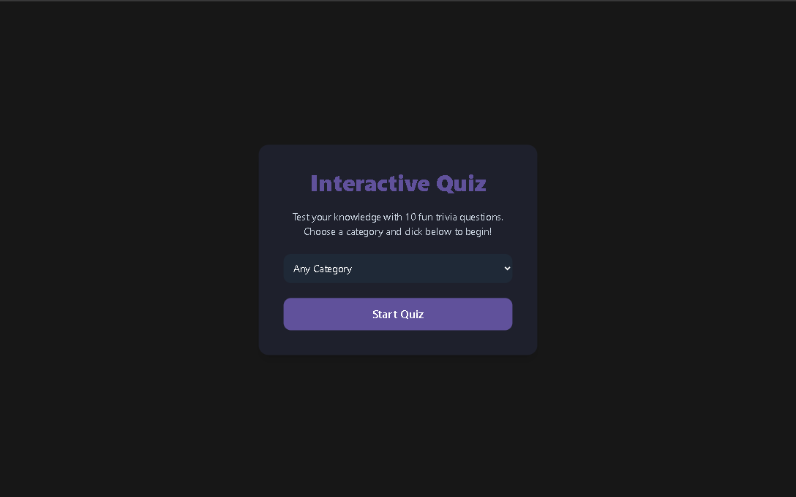

# 🧠 Interactive Quiz App

A fun and educational quiz app with timed questions, scoring system, and smooth transitions. Great for learning and testing knowledge interactively.

### 🔗 Live Demo
👉 [View Live Site](https://askweb12.netlify.app/)

---

## 🚀 Features

- Timed multiple-choice questions
- Score tracking and quiz result
- Animated transitions between questions
- Clean dark UI with progress bar
- Responsive and lightweight

---

## 🧰 Tech Stack

- React
- Tailwind CSS (CDN)
- Vite

---

## 📸 Screenshot



---

## 📦 Getting Started

1. Clone the repo:
```bash
git clone https://github.com/abdulsalamkhan441/interactive-quiz.git
